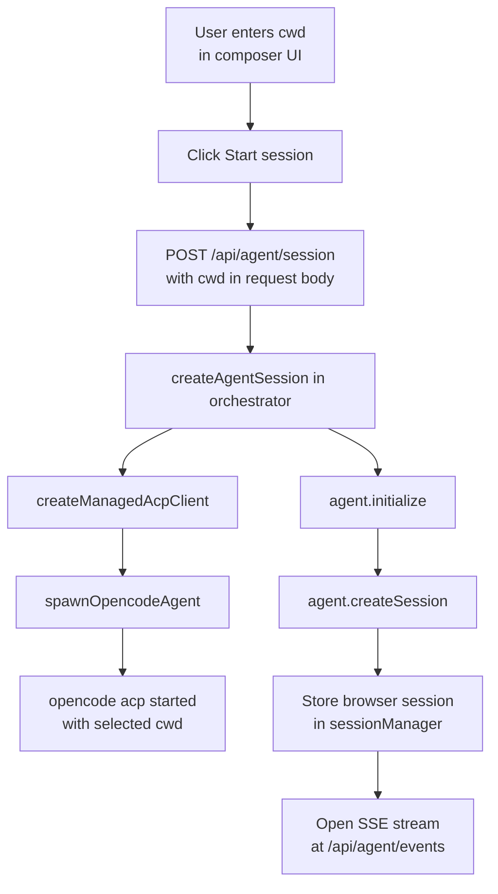
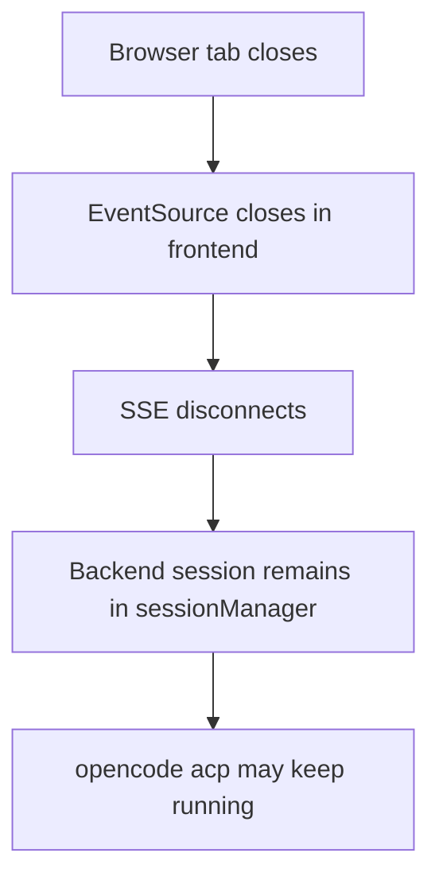

# Agent Lifecycle

This app starts the local `opencode acp` process from the server side.

## Init Flow

## When ACP Starts

`opencode acp` starts only after the user chooses a working directory and starts a session.

It is triggered by:

- `src/components/agent/PromptComposer.tsx`
- `src/components/agent/useAgentSession.ts`
- `startSession()` -> `createSessionIfNeeded(cwd)`
- `POST /api/agent/session` with `{ cwd }`

It does **not** start on page mount.

It does **not** wait for the first prompt either; session startup happens as soon as the user clicks `Start session`.

The backend now rejects session creation requests without a non-empty `cwd`.

## How It Is Managed

- `src/lib/acp/opencode.ts`: spawns and stops the child process
- `src/lib/acp/client.ts`: wraps ACP over stdin/stdout
- `src/lib/acp/session-manager.ts`: stores browser sessions in memory
- `src/lib/backend/orchestrator.ts`: creates sessions, sends prompts, handles mode/model/cancel
- `src/routes/api/agent/events.ts`: streams session events to the browser with SSE

## Current Cleanup Behavior

There is a disposal path:

- `sessionManager.disposeBrowserSession(id)`

That method calls `agent.dispose()`, which stops the `opencode acp` process.

But it is not currently wired into a runtime route or browser cleanup flow, so sessions may stay alive until explicit disposal or server restart.

## Suggested Management Options

1. Keep explicit session start, or move startup to first prompt if that UX is preferred.
2. Add an explicit close-session API that calls `disposeBrowserSession(id)`.
3. Add an idle timeout using `updatedAt`.
4. Dispose sessions when the owning browser connection is gone.
