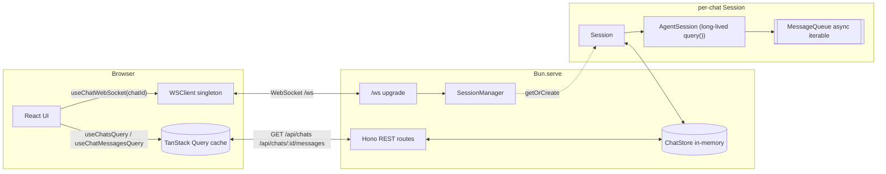
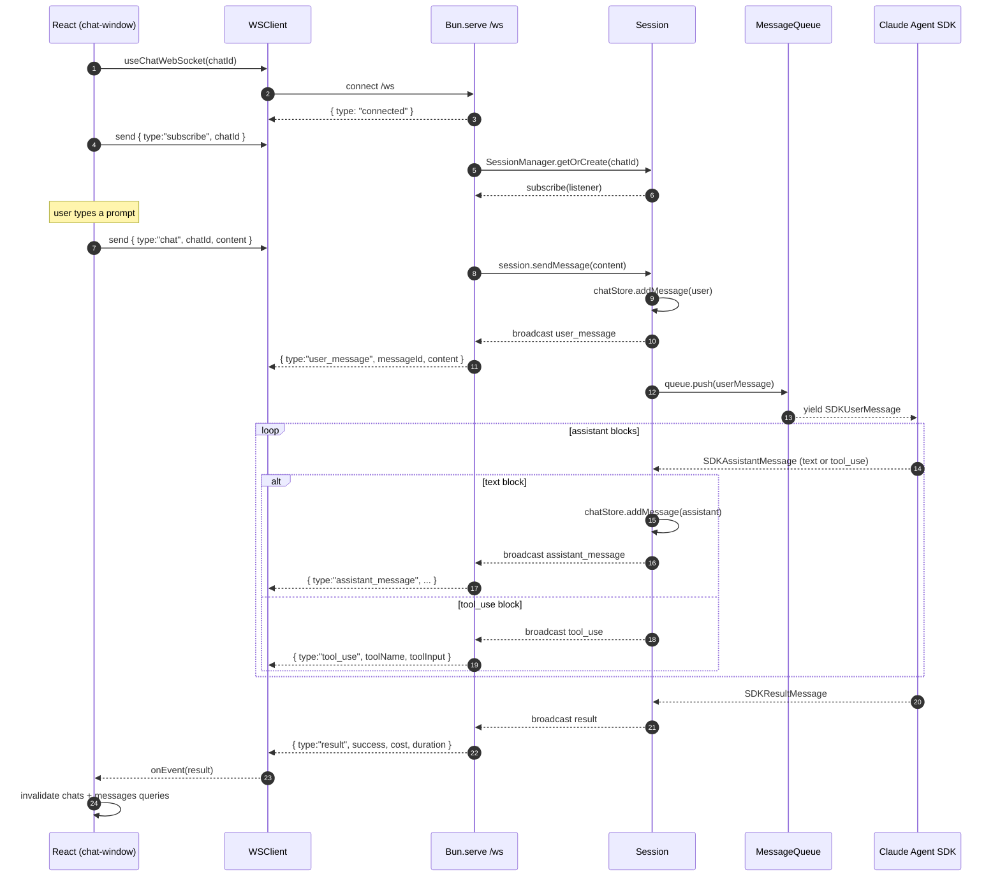

# Agent Streaming Architecture

This document describes how IPaper streams agent activity from the Claude
Agent SDK to the browser. The design is built around three ideas:

1. **One long-lived `query()` per chat.** A chat is not a sequence of
   independent requests — it is a single agent process whose stdin we keep
   feeding. That preserves conversational context, prompt-cache hits, and
   tool state across turns.
2. **WebSocket as the transport.** A single bidirectional connection
   carries `subscribe`, `chat`, and `unsubscribe` commands from the
   browser, and structured `AgentEvent`s back to it.
3. **REST as the source of truth for history.** The chat list and message
   history are fetched via REST (and cached by TanStack Query). The
   WebSocket only carries *live* activity — it never replays the past.

## High-level topology

The frontend talks to two endpoints that share the same Bun process:

- **Hono REST** for chats and message history.
- **A `Bun.serve` WebSocket upgrade** at `/ws` for live agent events.

`SessionManager` lazily allocates a `Session` per `chatId`. Each `Session`
wraps an `AgentSession`, which owns the single `query()` call that drives
that chat's agent for its entire lifetime.

## Lifecycle of a turn

The diagram below traces what happens from the moment the user opens a
chat until the agent finishes a response.

Key things to notice:

- **The agent is never restarted.** Steps 1–7 happen once per chat. From
  then on, every new prompt is just a `queue.push` into the running
  agent. This is what makes prompt-cache hits and multi-turn tool state
  possible.
- **The Session is the fan-out point.** All subscribers (typically one
  browser tab, but the design allows N) receive the same broadcast.
- **Persistence and broadcast happen together.** `chatStore.addMessage`
  is called *before* broadcasting, so a slow client never causes the
  store to disagree with what was sent on the wire.
- **The client trusts REST for history, WS for liveness.** When `result`
  arrives, the chat-window invalidates the message-list query so the
  authoritative store-backed history replaces any optimistic in-memory
  state.

## Wire protocol

### Client → server

| Type          | Payload                                | Meaning                                    |
| ------------- | -------------------------------------- | ------------------------------------------ |
| `subscribe`   | `{ chatId }`                           | Begin receiving events for this chat       |
| `unsubscribe` | `{ chatId }`                           | Stop receiving events                      |
| `chat`        | `{ chatId, content }`                  | Append a user message and run a turn       |

### Server → client

Every server-emitted event is JSON-encoded and (except `connected`) tagged
with `chatId`.

| Type                | Fields                                                   |
| ------------------- | -------------------------------------------------------- |
| `connected`         | —                                                        |
| `user_message`      | `messageId, content, timestamp`                          |
| `assistant_message` | `messageId, content, timestamp`                          |
| `tool_use`          | `toolId, toolName, toolInput`                            |
| `result`            | `success, cost?, duration?`                              |
| `error`             | `error` (string)                                         |

Each `assistant_message` carries a *complete* text block produced by the
agent — this is not token-by-token streaming. The "live" feel comes from
the agent emitting multiple text and tool blocks per turn, each delivered
on its own frame.

## Why WebSocket instead of SSE

The first version of IPaper used SSE: each user prompt opened a new POST
that streamed events for that turn only. That worked, but it had two
shortcomings:

- **A new agent process per turn.** Without a long-lived `query()`, every
  turn paid the cold-start cost and lost the prompt cache.
- **Per-turn lifecycle on the wire.** The transport's lifetime tracked a
  *turn*, not a *chat*. That made it awkward to push out-of-band events
  (e.g. "another tab updated this chat") and required threading a turn ID
  through the protocol.

Switching to a single WebSocket per browser session decouples the
transport's lifetime from any individual turn. The Session on the server
keeps running between turns; the socket keeps running between turns; the
agent keeps running between turns. Everything composes naturally.

## Reconnection and reliability

The browser's `WSClient` (`packages/web/src/lib/ws.ts`) is a singleton
with three responsibilities:

- **Auto-reconnect** with exponential backoff (capped at 15s).
- **Status broadcast** to `useChatWebSocket` consumers so the UI can show
  a "Connecting…" indicator.
- **Outbox** — messages sent while the socket is closed are buffered and
  flushed on the next `open`.

On reconnect, the `useChatWebSocket` hook re-issues `subscribe` for the
current chat. Because history lives in the chat store and is fetched via
REST, no events are lost permanently — the client simply re-renders from
the authoritative messages query after the next `result`.

## Failure modes

| Failure                              | Behavior                                                                           |
| ------------------------------------ | ---------------------------------------------------------------------------------- |
| Agent throws inside `query()`        | `Session` broadcasts `{ type:"error", error }`; UI surfaces it; agent stays closed |
| Client socket drops mid-turn         | Server keeps running the turn; events accumulate in subscribers (none); on reconnect the client invalidates messages query and the persisted assistant turns reappear |
| `chat` message references unknown id | Server replies `{ type:"error", error:"chat not found" }` and ignores the request  |
| Process restart                      | In-memory store is cleared (intentional for now — no DB layer)                     |

## Where to look in the code

- Server agent loop — [`packages/server/src/lib/agent-session.ts`](../packages/server/src/lib/agent-session.ts)
- Per-chat broadcast — [`packages/server/src/lib/session.ts`](../packages/server/src/lib/session.ts)
- Session pool — [`packages/server/src/lib/session-manager.ts`](../packages/server/src/lib/session-manager.ts)
- Chat & message store — [`packages/server/src/lib/chat-store.ts`](../packages/server/src/lib/chat-store.ts)
- WebSocket router — [`packages/server/src/routes/agent-ws.ts`](../packages/server/src/routes/agent-ws.ts)
- HTTP + upgrade entry — [`packages/server/src/index.ts`](../packages/server/src/index.ts)
- Browser WS singleton — [`packages/web/src/lib/ws.ts`](../packages/web/src/lib/ws.ts)
- React hook over WS — [`packages/web/src/lib/use-chat-ws.ts`](../packages/web/src/lib/use-chat-ws.ts)
- Chat view that consumes both REST + WS — [`packages/web/src/components/chat/chat-window.tsx`](../packages/web/src/components/chat/chat-window.tsx)
