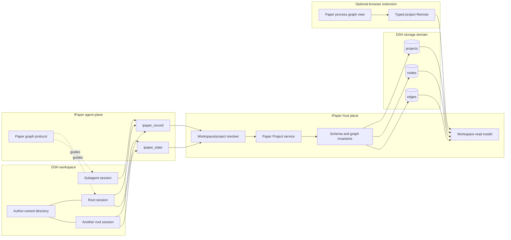
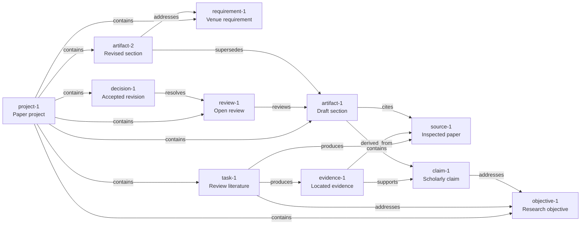
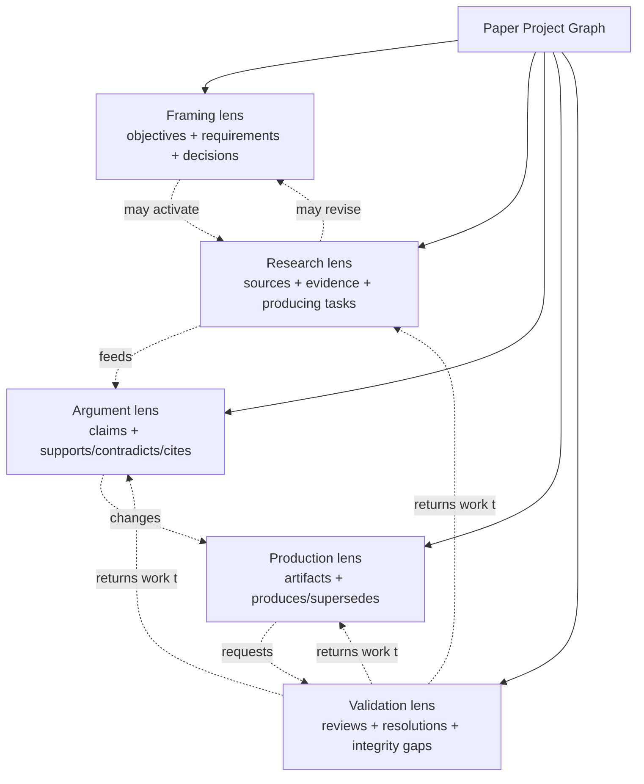
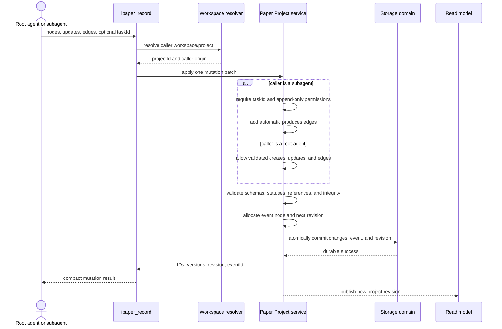

# IPaper Paper Project Graph Architecture

**Status:** Proposed
**Scope:** Workspace-scoped scholarly process model, host storage, agent tools, and read-model contract  
**Inspiration:** [`howmp/dsh-pentest`](https://github.com/howmp/dsh-pentest), adapted from a session-scoped engagement graph to a workspace-scoped paper project

## 1. Decision summary

IPaper will represent each DSH workspace as one durable **Paper Project Graph**.

- A workspace owns exactly one paper project.
- The project itself is the graph root node.
- Scholarly objects are typed nodes in one unified node model.
- Typed edges record relationships and provenance.
- The graph has no predefined or linear stage nodes.
- Process views are derived on demand from node kinds, node statuses, graph relationships, and history.
- Root agents and subagents use the same mutation tool, with host-enforced permissions based on caller context.
- The initial model-facing API contains only two tools: `ipaper_record` and `ipaper_state`.
- A model-facing report tool is deliberately deferred.

The architecture borrows dsh-pentest's authoritative host store, deterministic identifiers, explicit semantic edges, strict reference validation, serialized writes, structured subagent checkpoints, and read-only browser projection. It does not copy dsh-pentest's session ownership or its separate add-tool for every node type.

## 2. Goals

1. Capture the complete, evolving paper process across all sessions in one workspace.
2. Represent objectives, sources, evidence, claims, work, manuscript outputs, reviews, and decisions in one connected graph.
3. Allow research, writing, and review to happen repeatedly and concurrently without imposing a fixed workflow.
4. Keep the model tool catalog small and stable.
5. Preserve source integrity and provenance at the host boundary rather than relying only on prompt instructions.
6. Let subagents write structured checkpoints directly without requiring the root agent to transcribe their results.
7. Keep the browser a read model over host-owned data; browser-local state must not become scholarly source of truth.
8. Support later process reports, artifact exports, and richer paper views without changing the core graph vocabulary.

## 3. Non-goals for the first version

- No `ipaper_report` agent tool.
- No predefined Define/Research/Write/Review stage records.
- No global percentage-complete score.
- No hidden browser manuscript store or private editor API.
- No automatic claim or citation creation based only on filenames or generated prose.
- No deletion tool. Nodes are archived, rejected, cancelled, or superseded so process history remains available.
- No bundled replacement for the shared `@isomoes/dsh-web-ui` shell.

## 4. System architecture



### Plane ownership

The graph registry, storage domain, workspace resolution, concurrency control, and browser read contract are process-wide host services. They must not be instantiated once per agent preset or session.

The two model-facing tools and their protocol belong to the `ipaper` agent preset. This preserves DSH's host/agent separation: every session may select a preset, while all IPaper sessions in the same workspace still reach one canonical project.

## 5. Project identity and lifecycle

### 5.1 One project per workspace

A project is identified independently from any session:

```text
WorkspaceId -> PaperProjectId -> project root node
```

Every record also carries its `projectId`. A session resolves its project from its canonical workspace directory. When a subagent lacks a directly resolvable workspace, the service walks the session-parent relationship and uses the parent's workspace.

### 5.2 Automatic creation

Agents do not receive an initialization tool. The host owns an idempotent operation:

```text
ensurePaperProject(workspaceId)
```

On the first project read or write, it creates only:

```text
project-1
```

It does not create stage nodes, tasks, claims, or manuscript files. The host may also call the same operation at startup for already registered workspaces. Repeated calls return the existing project without resetting it.

### 5.3 Workspace removal

Removing a DSH workspace registration must not delete the author directory, session logs, or Paper Project Graph. Destructive project deletion is outside this architecture. An unregistered graph remains durable and may later be recovered through an explicit adoption/import design.

## 6. Unified graph model

The storage implementation has a project index, one node table, and one edge table. The project index is an implementation lookup; the project itself is also represented as the root graph node.



### 6.1 Base node shape

The TypeScript representation should be a discriminated union keyed by `kind`. Shared fields have one base contract; `attributes` is validated by a kind-specific schema rather than being an unrestricted property bag.

```ts
interface PaperNodeBase<Kind extends PaperNodeKind, Status extends string, Attributes> {
  readonly id: string
  readonly projectId: string
  readonly kind: Kind
  readonly title: string
  readonly summary: string
  readonly status: Status
  readonly attributes: Attributes
  readonly version: number
  readonly createdBySessionId: string
  readonly updatedBySessionId: string
  readonly createdAt: string
  readonly updatedAt: string
}
```

### 6.2 Node kinds

| Kind | Ownership | Purpose |
| --- | --- | --- |
| `project` | Host | Root aggregate for one workspace paper |
| `objective` | Root agent | Research question, hypothesis, intended contribution, or scope |
| `requirement` | Root agent | Venue, deadline, formatting, ethics, authorship, or submission constraint |
| `task` | Root agent | Bounded research, analysis, writing, or revision work |
| `source` | Agent | Paper, book, dataset, standard, website, or other inspected/discovered source |
| `evidence` | Agent | Located quotation, observation, result, measurement, or source-backed synthesis |
| `claim` | Agent | Proposed scholarly statement, hypothesis, result, or conclusion |
| `artifact` | Agent | Outline, section, manuscript, figure, table, dataset, bibliography, supplement, PDF, or submission package |
| `review` | Agent | Criticism, validation result, requested revision, or quality finding |
| `decision` | Root agent | Accepted or rejected choice with rationale |
| `note` | Agent | Structured information that does not yet fit a stronger scholarly type |
| `event` | Host | Immutable audit record for one successful graph mutation batch |

`project` and `event` are system-controlled. A model cannot create or edit them directly.

### 6.3 Kind-specific status vocabulary

There is no universal linear workflow. Status values are validated according to node kind.

| Kind | Status values |
| --- | --- |
| `project` | `active`, `archived` |
| `objective` | `proposed`, `accepted`, `resolved`, `retired` |
| `requirement` | `open`, `satisfied`, `waived` |
| `task` | `pending`, `active`, `blocked`, `done`, `cancelled` |
| `source` | `discovered`, `inspected`, `verified`, `rejected` |
| `evidence` | `unverified`, `verified`, `disputed` |
| `claim` | `proposed`, `supported`, `contested`, `rejected` |
| `artifact` | `planned`, `draft`, `review`, `ready`, `superseded` |
| `review` | `open`, `resolved` |
| `decision` | `proposed`, `accepted`, `reversed` |
| `note` | `active`, `archived` |
| `event` | `recorded` |

### 6.4 Artifact attributes

An artifact node describes an author-owned or generated output without storing an editor-private document in the browser. Typical attributes include:

```ts
interface ArtifactAttributes {
  readonly artifactType: 'outline' | 'section' | 'manuscript' | 'figure' | 'table' | 'dataset' | 'bibliography' | 'supplement' | 'pdf' | 'submission-package' | 'other'
  readonly path?: string
  readonly mimeType?: string
  readonly checksum?: string
  readonly versionLabel?: string
}
```

Paths are workspace-relative in the wire/tool contract and canonicalized by the host before validation. Recording an artifact does not imply that a file exists; a path-bearing artifact must be checked explicitly.

### 6.5 Source and evidence attributes

Source and evidence nodes distinguish discovery from inspection and support exact provenance.

```ts
interface SourceAttributes {
  readonly citationKey?: string
  readonly doi?: string
  readonly url?: string
  readonly bibliographicMetadataVerified: boolean
}

interface EvidenceAttributes {
  readonly evidenceType: 'quotation' | 'paraphrase' | 'observation' | 'measurement' | 'result' | 'synthesis' | 'other'
  readonly locator?: string
  readonly confidence?: number
  readonly verbatim: boolean
}
```

A verbatim evidence node requires an exact locator. Evidence must have a `derived_from` relationship to a source, dataset, artifact, or other inspectable origin before it can justify a supported claim.

## 7. Edge vocabulary

Edges are first-class durable relationships, but they are not modeled as nodes. This keeps traversal, referential validation, and graph rendering simple.

```ts
interface PaperEdge {
  readonly id: string
  readonly projectId: string
  readonly kind: PaperEdgeKind
  readonly sourceId: string
  readonly targetId: string
  readonly createdBySessionId: string
  readonly createdAt: string
}
```

| Edge | Direction and meaning |
| --- | --- |
| `contains` | Aggregate or artifact -> contained node |
| `addresses` | Task, claim, artifact, or decision -> objective or requirement |
| `depends_on` | Node -> prerequisite node |
| `produces` | Task -> source, evidence, claim proposal, artifact, review, or note |
| `derived_from` | Evidence, claim, or artifact -> inspected origin |
| `supports` | Evidence -> claim |
| `contradicts` | Evidence -> claim |
| `cites` | Claim or artifact -> source |
| `reviews` | Review -> claim or artifact |
| `resolves` | Decision or replacement artifact -> review, objective, or requirement |
| `supersedes` | New artifact, decision, or claim revision -> previous node |
| `affects` | System event -> created or updated semantic node |

Every semantic node must be reachable from `project-1`. When a root-agent batch creates a node without another containment path, the host adds `project-1 contains <node>`.

## 8. Dynamic process model

IPaper does not persist stages. It computes process **lenses** from the current subgraph. Lenses may overlap, appear or disappear, and be active concurrently.



### 8.1 Lens status derivation

A lens is a pure read-model result, never a stored workflow state.

Examples:

- Framing needs attention when accepted objectives have no addressing task or artifact, or open requirements have no addressing node.
- Research is active while research-related tasks are active or sources/evidence remain unverified.
- Argument needs attention when a claim is unsupported, contested, or marked supported without valid supporting evidence.
- Production is active while artifacts are planned, draft, or under review.
- Validation needs attention while reviews remain open, ready artifacts cite unverified sources, or integrity checks find unsupported claims.

The UI should show concrete counts, blockers, and unresolved node IDs. It should not manufacture a global completion percentage.

### 8.2 Related-node expansion

The graph view begins with a compact neighborhood and expands on demand:

1. select a node;
2. load its incoming and outgoing edges;
3. group neighbors by relationship and kind;
4. expand another hop only when requested;
5. keep large graphs paginated.

This is the primary mechanism for showing changing process context without fixed stages.

## 9. Storage domain

The proposed domain name is `ipaper-project`, version 1.

```text
ipaper-project
├── projects
├── nodes
└── edges
```

### 9.1 Project index record

```ts
interface PaperProjectRecord {
  readonly projectId: string
  readonly workspaceId: string
  readonly workspacePath: string
  readonly rootNodeId: string
  readonly revision: number
  readonly nextNodeSequenceByKind: Readonly<Record<string, number>>
  readonly nextEdgeSequence: number
  readonly createdAt: string
  readonly updatedAt: string
}
```

### 9.2 Physical keys and deterministic IDs

Physical keys are project-scoped:

```text
nodes: <projectId>:<nodeId>
edges: <projectId>:<edgeId>
```

Logical IDs are deterministic inside one project:

```text
objective-1
task-1
source-1
evidence-1
claim-1
artifact-1
review-1
decision-1
event-1
edge-1
```

The host returns actual IDs from every mutation so later calls never guess identifiers.

### 9.3 Concurrency and atomicity

- Writes serialize per project, not per session.
- A batch validates completely before its first durable write.
- Failed batches must not expose partial nodes or edges.
- Backends without transactions require rollback or a recoverable pending-mutation marker.
- Updates carry an expected node version when replacing mutable content. A stale version rejects and requires `ipaper_state` followed by a deliberate retry.
- The project revision increments once per successful batch.

### 9.4 Mutation events

One successful `ipaper_record` batch creates one immutable `event` node. Its attributes record:

- operation summary;
- caller session and origin;
- created node IDs;
- updated node IDs and before/after versions;
- created edge IDs;
- committed project revision and timestamp.

The event has `affects` edges to involved semantic nodes. Event nodes are omitted from the default process graph and returned through history queries.

## 10. Model-facing tools

The initial catalog has exactly two tools.

### 10.1 `ipaper_record`

`ipaper_record` is the only mutation tool. It supports batch creation, updates, and edge creation.

Conceptual input:

```ts
interface IPaperRecordInput {
  readonly taskId?: string
  readonly nodes?: readonly {
    readonly ref: string
    readonly kind: Exclude<PaperNodeKind, 'project' | 'event'>
    readonly title: string
    readonly summary?: string
    readonly status?: string
    readonly attributes?: unknown
  }[]
  readonly updates?: readonly {
    readonly id: string
    readonly expectedVersion: number
    readonly title?: string
    readonly summary?: string
    readonly status?: string
    readonly attributesPatch?: unknown
  }[]
  readonly edges?: readonly {
    readonly source: string
    readonly kind: PaperEdgeKind
    readonly target: string
  }[]
}
```

`ref` is a call-local alias. Edge endpoints may use an existing logical node ID or a `ref` created in the same batch.

Conceptual result:

```ts
interface IPaperRecordResult {
  readonly projectId: string
  readonly revision: number
  readonly created: Readonly<Record<string, string>>
  readonly updated: readonly { readonly id: string; readonly version: number }[]
  readonly edgeIds: readonly string[]
  readonly eventId: string
}
```

#### Root-agent behavior

A root agent may:

- create every model-owned node kind;
- update existing mutable semantic nodes with version checks;
- create valid edges among existing and newly created nodes;
- accept/reverse decisions and resolve reviews;
- archive, reject, cancel, or supersede rather than delete.

It may not create or edit `project` and `event` nodes.

#### Subagent behavior

The same tool detects a subagent caller from session origin/lineage. A subagent:

- must provide a concrete existing `taskId` from the delegation;
- writes to the project resolved from its workspace or parent session;
- may append sources, evidence, proposed claims, artifacts, reviews, and notes;
- may connect its newly created nodes to each other and to supplied existing nodes;
- may not update existing nodes;
- may not create objectives, requirements, tasks, decisions, projects, or events;
- receives automatic `taskId produces <created-node>` edges;
- cannot reference a node from another project.

This replaces dsh-pentest's separate `submit` tool because IPaper data is workspace-scoped. The host retains the same commander/worker restrictions without exposing another model tool.

#### Example root call

```json
{
  "nodes": [
    {
      "ref": "review-task",
      "kind": "task",
      "title": "Review transformer literature",
      "summary": "Find primary sources and extract evidence relevant to the accepted objective.",
      "status": "active"
    }
  ],
  "edges": [
    {
      "source": "review-task",
      "kind": "addresses",
      "target": "objective-1"
    }
  ]
}
```

#### Example subagent call

```json
{
  "taskId": "task-1",
  "nodes": [
    {
      "ref": "source",
      "kind": "source",
      "title": "Attention Is All You Need",
      "summary": "Primary transformer architecture paper inspected by the worker.",
      "status": "inspected",
      "attributes": {
        "doi": "10.48550/arXiv.1706.03762",
        "bibliographicMetadataVerified": true
      }
    },
    {
      "ref": "evidence",
      "kind": "evidence",
      "title": "Self-attention replaces recurrent sequence operations",
      "summary": "Located support for the architectural comparison.",
      "status": "verified",
      "attributes": {
        "evidenceType": "paraphrase",
        "locator": "Section 3",
        "verbatim": false
      }
    }
  ],
  "edges": [
    {
      "source": "evidence",
      "kind": "derived_from",
      "target": "source"
    }
  ]
}
```

The host additionally records:

```text
task-1 produces source-1
task-1 produces evidence-1
```

### 10.2 `ipaper_state`

`ipaper_state` is the only model-facing read tool.

Conceptual input:

```ts
interface IPaperStateInput {
  readonly view?: 'overview' | 'graph' | 'related' | 'history'
  readonly nodeId?: string
  readonly kinds?: readonly PaperNodeKind[]
  readonly statuses?: readonly string[]
  readonly query?: string
  readonly cursor?: string
  readonly limit?: number
}
```

Views:

| View | Purpose |
| --- | --- |
| `overview` | Compact project revision, kind/status counts, active work, blockers, unsupported claims, open reviews, and relevant IDs |
| `graph` | Filtered and paginated nodes and edges |
| `related` | One node plus bounded incoming/outgoing neighborhood; requires `nodeId` |
| `history` | Mutation events affecting one node or the project; paginated |

The default is `overview`. Outputs must remain compact enough for model context. The model requests detail only for relevant node IDs.

## 11. Tool and storage data flow



## 12. Graph invariants

The host must reject a mutation that violates any of these rules:

1. Exactly one `project` root exists for a project.
2. Every referenced node and edge endpoint belongs to the same project.
3. Every semantic node is reachable from the root.
4. Call-local refs are unique and resolve within the batch.
5. Node status is valid for its node kind.
6. `contains` and `supersedes` relations cannot form cycles.
7. A node cannot supersede itself.
8. `supports` and `contradicts` target claims and originate from evidence.
9. A claim cannot transition to `supported` without valid incoming support.
10. Verbatim evidence requires an exact locator.
11. Evidence used as support must identify an inspectable origin through `derived_from`.
12. A source marked `verified` must carry validated identifying metadata or an explicit verification record.
13. Path-bearing artifacts must remain inside the owning workspace.
14. An artifact marked `ready` cannot depend on a superseded or missing required artifact without an explicit accepted decision.
15. A resolved review must have a `resolves` relationship from a decision or replacement artifact.
16. A subagent mutation obeys its restricted node-kind and append-only policy.
17. Every successful batch creates exactly one immutable event node and increments the project revision once.

These invariants supplement, rather than weaken, IPaper's existing prohibition on fabricated citations, quotations, bibliographic metadata, data, and results.

## 13. Read model and browser boundary

A DSH session projection cannot be the canonical UI source because it replays one session while a Paper Project Graph aggregates multiple independent sessions. The storage domain remains canonical.

The host should expose a typed workspace-level read contract that returns:

```ts
interface PaperProjectSnapshot {
  readonly projectId: string
  readonly workspaceId: string
  readonly revision: number
  readonly root: PaperNode
  readonly nodes: readonly PaperNode[]
  readonly edges: readonly PaperEdge[]
  readonly cursor?: string
}
```

Both `ipaper_state` and a future browser Remote use the same pure derivation helpers for overview, related-node expansion, lens status, and integrity gaps.

Under the current repository ownership rules, IPaper bundles only its branding browser client. A future paper-process browser surface should therefore be delivered as a separate profile-root extension package unless that ownership rule is explicitly changed. It should use typed host contracts and documented shared Web UI slots rather than copying or forking shared shell source.

## 14. Suggested implementation boundaries

The eventual host implementation should remain split into focused modules:

```text
packages/dsh-ipaper/src/paper-project/
├── spec.ts          node, edge, project, and domain schemas
├── types.ts         shared public graph vocabulary
├── store.ts         project queues, IDs, persistence, rollback/recovery
├── invariants.ts    pure graph and scholarly-integrity validation
├── derive.ts        overview, lenses, related graph, and history views
├── service.ts       host Paper Project service and workspace resolution
├── tools.ts         ipaper_record and ipaper_state registration
└── instructions.ts  concise graph-recording protocol
```

Composition should mount the storage/service host row before any dependent Remote or browser row. The model-facing tool row belongs in `preset/ipaper/agent.cordis.yml`, while singleton storage and project services remain in `cordis.patch.yml`.

Generated `packages/dsh-ipaper/lib/` files must never be edited directly.

## 15. Validation strategy

Implementation tests should cover:

- automatic idempotent project-root creation per workspace;
- two root sessions resolving the same project;
- subagents resolving the workspace directly or through parent lineage;
- deterministic per-project IDs;
- node-kind and status validation;
- same-project reference rejection;
- local-ref batch resolution;
- root-agent and subagent permission differences through the same tool;
- automatic `produces`, `contains`, and `affects` edges;
- full rollback or recovery from a partial storage failure;
- optimistic node-version conflicts;
- dynamic lens derivation without persisted stages;
- unsupported/contested claim and unverified-source integrity gaps;
- graph, related, and history pagination;
- package exports, Cordis ordering, preset tool availability, and shipped documentation.

## 16. Deferred extensions

The following build on the same graph without expanding the initial tool catalog:

- process report generation and export;
- portable `.ipaper` graph export/import;
- bibliography and citation validation services;
- manuscript editor and explicit save service;
- compilation, PDF preview, and submission packaging;
- reviewer response and rebuttal views;
- artifact checksum/version automation;
- graph search/indexing and large-project pagination;
- collaboration, authorship approval, and role-aware human edits.

A later report feature should derive from the graph read model. It should not become a competing source of truth.